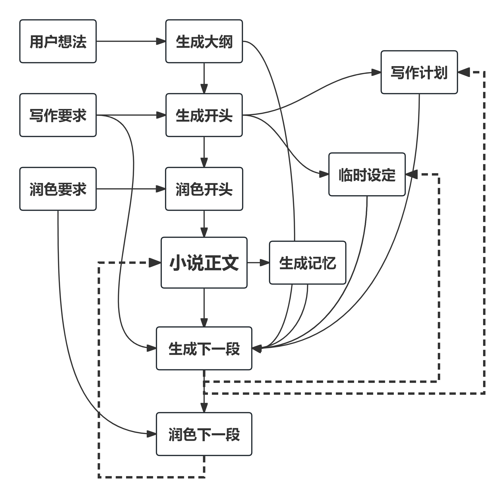
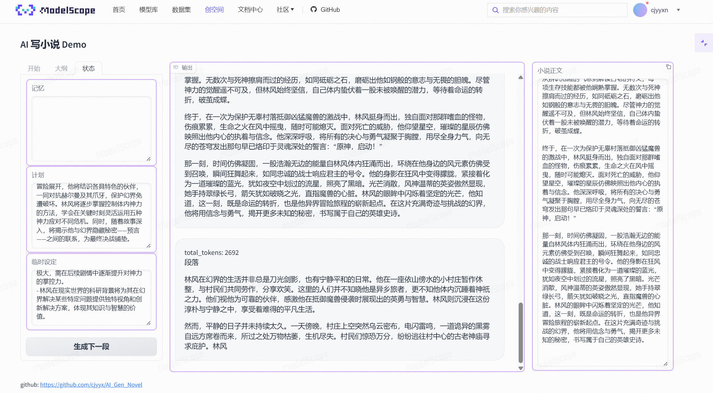

# 探究 AI 写网文能力的极限

## 简介

近年来，AI在文学创作领域取得了显著进展。从AI微小说大赛到阅文妙笔，再到Midreal AI，这些案例都证明了AI在文学创作上的巨大潜力。作为一名网络文学爱好者，我希望通过大语言模型与多智能体技术，来开发一款能够自动生成网络小说的应用。

网文的创作，可以套用**写作的认知过程模型**，该模型将写作视为一个目标导向的思考过程，包括非线性的认知活动：计划、转换和审阅。

文献和实践表明，LLM 在转换和审阅上表现较好，而在计划阶段存在缺陷。具体体现为

- 有限的理解和推理能力
- 无法记忆和生成长文本
- 缺乏原创性和多样性

面对这些问题，我的解决方案是

- 利用LLM的能力压缩长文本为几句话组成的记忆
- 优化Prompt，多智能体协作，激发 LLM 的能力，提升其原创性
- 借鉴**RecurrentGPT**的核心思想，基于语言的循环计算，通过迭代的方式创作任意长度的文本
- 结合网络小说创作的先验知识，对创作流程进行优化



经过一定的探索后，我认为**目前的大语言模型还没有足够的能力创作长篇网络小说**。

未来可能的发展方向是：

对大模型能力要求

- 更长的上下文
- 更强的理解和推理能力
- 以人为评判标准的网文生成的强化学习训练

程序架构的优化

- 多次尝试，多智能体讨论，提升原创性
- 引入更多先验知识，如结构化的剧情框架


## 在线体验

https://modelscope.cn/studios/cjyyxn/AI_Gen_Novel/summary



## 快速上手指南

### 步骤1: 环境配置

首先，安装所需的依赖项：

```bash
pip install -r requirements.txt
```

### 步骤2: 实现LLM接口

项目依赖一个大语言模型。你需要实现`LLM.py`中的`chatLLM`函数。

### 步骤3: 运行项目

- 直接运行`demo.py`，将自动创作小说，并将结果保存在`novel_record.md`文件中。

- 运行`app.py`启动一个基于gradio的应用，通过打开显示的链接，你可以体验到AI小说生成的可视化过程。

